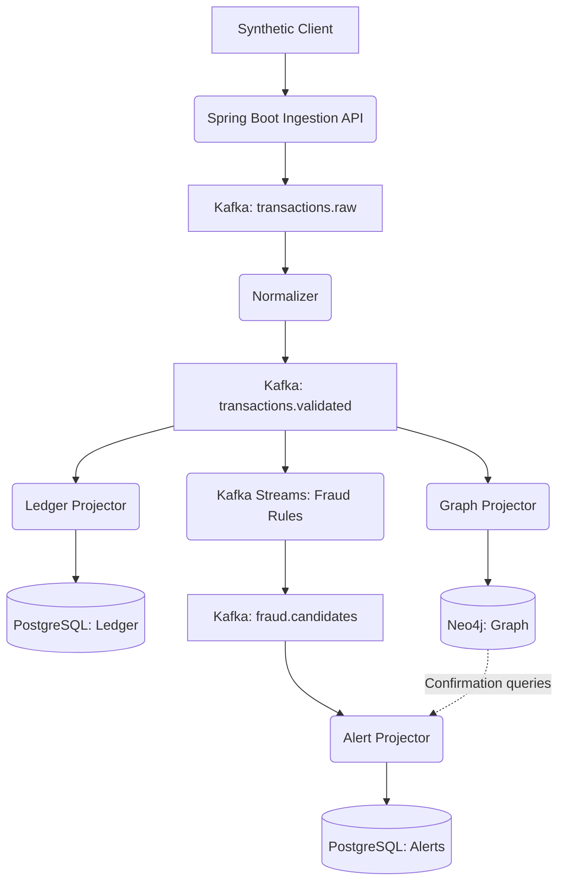

# MuleGraph Architecture

```mermaid
flowchart TD
    client[Synthetic Client] --> api(Spring Boot Ingestion API)
    api --> kafka_raw[Kafka: transactions.raw]
    kafka_raw --> normalizer(Normalizer)
    normalizer --> kafka_val[Kafka: transactions.validated]
    
    kafka_val --> ledger_proj(Ledger Projector)
    ledger_proj --> pg_ledger[(PostgreSQL: Ledger)]
    
    kafka_val --> stream_rules(Kafka Streams: Fraud Rules)
    stream_rules --> kafka_cand[Kafka: fraud.candidates]
    
    kafka_cand --> alert_proj(Alert Projector)
    alert_proj --> pg_alerts[(PostgreSQL: Alerts)]
    
    kafka_val --> graph_proj(Graph Projector)
    graph_proj --> neo4j[(Neo4j: Graph)]
    
    neo4j -.-> |Confirmation queries| alert_proj
```
